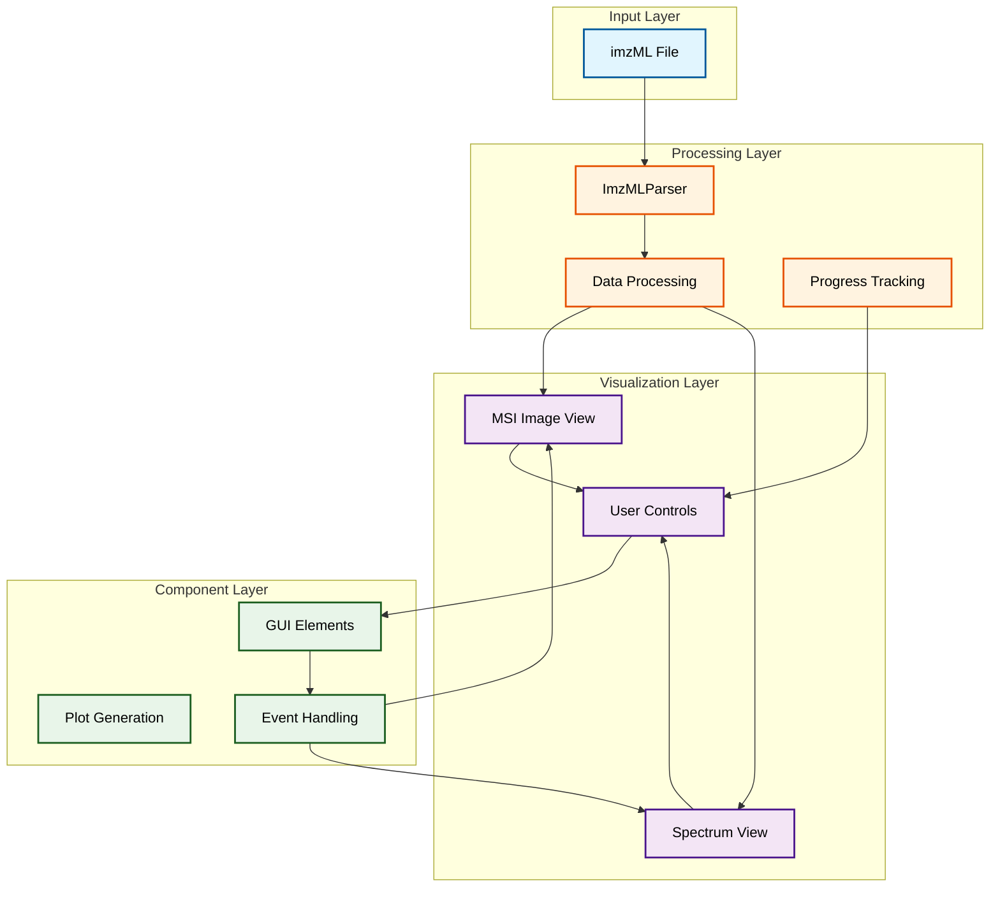
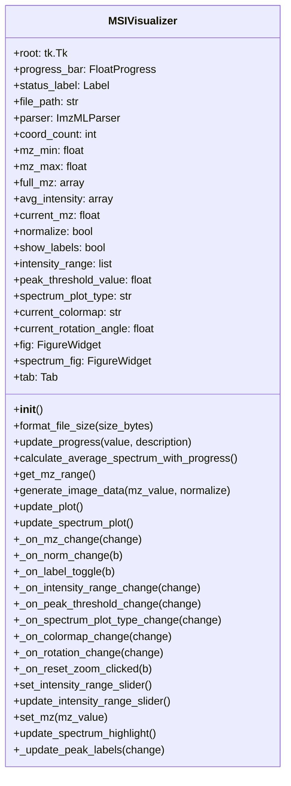

The MSIVisualizer is a Python class that provides an interactive visualization tool for Mass Spectrometry Imaging (MSI) data. It combines GUI controls with real-time visualization capabilities to help researchers analyze MSI data through both spatial and spectral views.

###  System Architecture

The MSIVisualizer implements a modular architecture with clear separation of concerns between data processing, visualization, and user interface components. Here's the high-level architecture:



The diagram above illustrates the four main layers of the MSIVisualizer system:

- **Input Layer** (blue): Handles the loading of imzML files, the standard format for MSI data
- **Processing Layer** (orange): Manages data parsing and processing, including progress tracking for large datasets
- **Visualization Layer** (purple): Contains the core visualization components for both MSI images and mass spectra
- **Component Layer** (green): Handles user interactions and event processing

Data flows from top to bottom through these layers, with user interactions triggering updates that flow back up through the system. The Progress Tracking component ensures users are informed about long-running operations.

###  Class Structure

The MSIVisualizer class implements this architecture through a structured set of methods and attributes. Here's the class structure:



The class diagram shows the complete structure of the MSIVisualizer class. Methods prefixed with `_` are intended to be private (internal use), while public methods are used for external interaction. The class maintains several key attributes:

- **GUI Elements**: `root`, `progress_bar`, `status_label` handle the user interface
- **Data Storage**: `parser`, `full_mz`, `avg_intensity` store the MSI data
- **Visualization State**: `current_mz`, `normalize`, `intensity_range` track the current view settings
- **Plot Objects**: `fig` and `spectrum_fig` manage the visual representations

###  Documentation

####  Class Description

```python
class MSIVisualizer:
    """
    A class for visualizing Mass Spectrometry Imaging (MSI) data from imzML files.
    
    Provides interactive visualization of MSI data with both spatial and spectral views.
    Features include:
    - Interactive m/z selection
    - Intensity normalization
    - Peak detection and labeling
    - Image rotation and colormap selection
    - Real-time spectrum updates
    """
    def __init__(self):
        """
        Initialize the visualizer with GUI file selection and peak threshold control.
        
        Creates a tabbed interface with MSI image view, mass spectrum view, and peak table.
        """
        # ... initialization code ...
```

####  Key Methods

```python
def generate_image_data(self, mz_value, normalize=False):
    """
    Generate image data for the specified m/z value.
    
    Args:
        mz_value (float): The m/z value to visualize
        normalize (bool): Whether to normalize intensities by TIC
        
    Returns:
        tuple: (x_coords, y_coords, intensity_map)
    """
    # ... implementation ...

def update_spectrum_plot(self):
    """
    Updates the spectrum visualization based on selected plot type.
    
    Supports line, area, and centroid plot types with peak detection and labeling.
    """
    # ... implementation ...

def set_mz(self, mz_value):
    """
    Set the m/z value and update the plot.
    
    Args:
        mz_value (float): The m/z value to display (must be within valid range)
    """
    # ... implementation ...
```

####  Usage Example

```python
# Create a new visualizer instance
visualizer = MSIVisualizer()

# Set a specific m/z value
visualizer.set_mz(500.0)

# Toggle normalization
visualizer._on_norm_change(None)  # None is required for the event handler
```

###  Features

1. **Interactive Visualization**  - Real-time MSI image updates
  - Dynamic spectrum display
  - Peak detection and labeling
  - Interactive m/z selection


2. **Data Processing**  - Automatic intensity normalization
  - Progress tracking for large datasets
  - Efficient spectrum averaging
  - Peak detection with threshold control


3. **User Interface**  - Tabbed interface for different views
  - Interactive sliders and controls
  - Real-time updates
  - Progress indicators


###  Requirements

- Python 3.x
- Required libraries:
  - `pyimzml` for imzML parsing
  - `numpy` for numerical operations
  - `plotly` for visualization
  - `ipywidgets` for interactive controls
  - `scipy` for signal processing
  - `pandas` for data handling
  - `tkinter` for file selection


###  Known Limitations

1. Memory usage can be high for large datasets
2. Performance may vary depending on system specifications
3. Some features may require optimization for very large files

###  Troubleshooting

1. If file loading fails:
  - Verify imzML file format
  - Check file permissions
  - Ensure sufficient memory


2. If visualization is slow:
  - Try reducing the intensity range
  - Consider using a smaller dataset
  - Check system resources

Example of MSI (showing a 1000 ng/mL spot of clozapine) Imaged on the SELECT SERIES MALDI MRT 


Example of the average spectra showing the clozapine peak at m/z 327.14 


Example of MSI visualisation of fingermark section shopwing the ridges at 25 x 25 micron resolution Imaged on the SELECT SERIES MALDI MRT 


