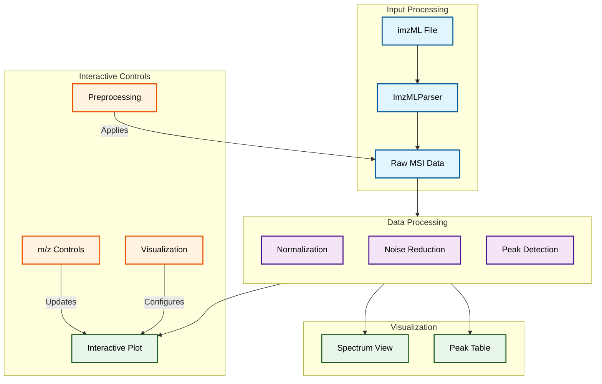

The MSIView is a Python script (Jupyternotebook-based) that provides an interactive visualization tool for Mass Spectrometry Imaging (MSI) data. It combines GUI controls with real-time visualization capabilities to help researchers analyze MSI data through both spatial and spectral views.

###  System Architecture

The MSIView implements a modular architecture with clear separation of concerns between data processing, visualization, and user interface components. Here's the high-level architecture:

This is a comprehensive documentation for the Mass Spectrometry Imaging (MSI) Visualizer, a sophisticated tool for analyzing and visualizing mass spectrometry imaging data. The visualizer provides an interactive interface for exploring MSI data through both spatial and spectral views.

###  Overview

The MSIVisualizer class creates an interactive visualization environment that combines:

- Spatial visualization of MSI data
- Mass spectrum analysis
- Peak detection and labeling
- Data preprocessing capabilities
- Interactive controls for real-time exploration

Let's visualize the architecture and data flow:



The diagram above illustrates the visualizer's architecture, where:

- Blue components handle input data processing
- Orange sections represent user controls that drive the visualization
- Purple shows the data processing pipeline
- Green indicates the final visualization outputs

The Processing section feeds into all visualization components, allowing real-time updates as users adjust controls. The bidirectional arrows between Controls and Plot indicate that user interactions immediately update the visualization, while the plot itself provides feedback through hover information and click events.

###  Component Overview

####  Input Processing

- Handles imzML file selection and parsing
- Manages file size and coordinate information
- Provides progress tracking during loading

####  Interactive Controls

1. **m/z Controls**  - Slider for selecting specific m/z values
  - Text input for precise m/z entry
  - Normalization toggle for TIC (Total Ion Current)


2. **Preprocessing Options**  - Baseline correction (detrend)
  - Noise reduction (Savitzky-Golay filter)
  - Intensity range adjustment


3. **Visualization Settings**  - Colormap selection
  - Image rotation control
  - Peak labeling customization


####  Visualization Components

1. **MSI Image View**  - Interactive heatmap showing spatial distribution
  - Real-time updates based on m/z selection
  - Supports rotation and intensity scaling


2. **Mass Spectrum View**  - Displays average mass spectrum
  - Multiple plot types (line, area, centroid)
  - Interactive peak detection and labeling


3. **Peak Table**  - Organizes detected peaks
  - Provides detailed peak information
  - Supports filtering and sorting


###  Key Features

1. **Data Processing**```python
def generate_image_data(self, mz_value, normalize=False):
    """Generate image data efficiently."""
    # Precompute the m/z range mask
    mz_mask = (mz_value - 0.1, mz_value + 0.1)
    intensity_map = []
    for i, _ in enumerate(self.parser.coordinates):
        try:
            mz_values, intensities = self.parser.getspectrum(i)
            mask = (mz_values >= mz_mask[0]) & (mz_values <= mz_mask[1])
            if np.any(mask):
                intensity = np.sum(intensities[mask])
                if normalize:
                    tic = np.sum(intensities)
                    intensity = intensity / tic if tic > 0 else 0
            else:
                intensity = 0
            intensity_map.append(intensity)
        except Exception as e:
            print(f"Warning: Skipping spectrum {i} due to error: {str(e)}")
            intensity_map.append(0)
    return np.array(x_coords), np.array(y_coords), np.array(intensity_map)
```


2. **Peak Detection**```python
def find_peaks_in_view(self):
    """Finds peaks in the average spectrum that are within the current x-axis range."""
    current_xaxis_range = self.spectrum_fig.layout.xaxis.range
    mask = (self.full_mz >= current_xaxis_range[0]) & (self.full_mz <= current_xaxis_range[1])
    mz_in_view = self.full_mz[mask]
    intensity_in_view = self.avg_intensity[mask]

    if not mz_in_view.size:
        return []

    peak_indices = find_peaks(intensity_in_view, height=self.peak_threshold_value)[0]
    peaks = []
    for index in peak_indices:
        peak_mz = mz_in_view[index]
        peak_intensity = intensity_in_view[index]
        peaks.append((peak_mz, peak_intensity))

    return peaks
```


###  Usage Guide

1. **Initialization**```python
visualizer = MSIVisualizer()
```


2. **Basic Navigation**  - Use the m/z slider or text input to explore different mass-to-charge ratios
  - Toggle TIC normalization for relative intensity comparison
  - Adjust colormap and rotation for optimal visualization


3. **Spectrum Analysis**  - Click on peaks in the spectrum view to jump to specific m/z values
  - Use the peak threshold slider to adjust peak detection sensitivity
  - Customize peak labels through the dropdown menus


4. **Data Processing**  - Apply baseline correction for drift removal
  - Use noise reduction for signal smoothing
  - Adjust intensity ranges for better visualization


###  Customization Options

1. **Peak Labeling**  - Color selection (black, red, blue, green)
  - Font size adjustment (8-20 points)
  - Label content options (m/z, m/z + intensity)


2. **Visualization Settings**  - Colormap selection (Viridis, Plasma, Rainbow, etc.)
  - Image rotation (0-360 degrees)
  - Plot type selection (line, area, centroid)


###  Error Handling

The visualizer includes comprehensive error handling:

- File loading validation
- Spectrum processing error recovery
- Graceful handling of invalid inputs
- Progress tracking with error reporting


This documentation provides a comprehensive guide to using the MSIVisualizer for mass spectrometry imaging data analysis. The interactive nature of the tool, combined with its robust error handling and extensive customization options, makes it an effective platform for MSI data exploration and analysis.


###  Requirements

- Python 3.x
- Required libraries:
  - `pyimzml` for imzML parsing
  - `numpy` for numerical operations
  - `plotly` for visualization
  - `ipywidgets` for interactive controls
  - `scipy` for signal processing
  - `pandas` for data handling
  - `tkinter` for file selection


###  Known Limitations

1. Memory usage can be high for large datasets
2. Performance may vary depending on system specifications
3. Some features may require optimization for very large files

###  Troubleshooting

1. If file loading fails:
  - Verify imzML file format
  - Check file permissions
  - Ensure sufficient memory


2. If visualization is slow:
  - Try reducing the intensity range
  - Consider using a smaller dataset
  - Check system resources

Example of MSI (showing a 1000 ng/mL spot of clozapine) Imaged on the SELECT SERIES MALDI MRT 


Example of the average spectra showing the clozapine peak at m/z 327.14 


Example of MSI visualisation of fingermark section showing the ridges at 25 x 25 micron resolution Imaged on the SELECT SERIES MALDI MRT 


Example of MSI visualisation of fingermark  showing the ridges contaminated with Diazepam (m/z 285.07) at 50 x 50 micron resolution Imaged on the SELECT SERIES MALDI MRT


